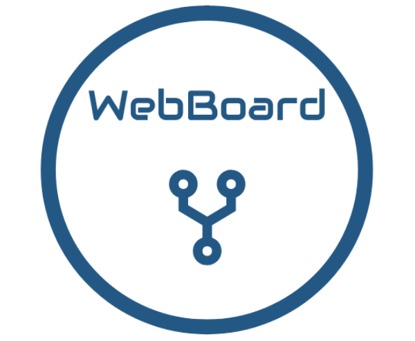

WebBoard
===
 [](https://github.com/danielschwabacher/webboard)    [](https://www.npmjs.com/package/webboard)


<p align="center">
	
</p>
<h3 align="center">Browser based, open source electronics prototyping. </h3>

Overview
--------
WebBoard is a drag n' drop GUI for electronics prototyping. With WebBoard, you can create dynamic and reactive Arduino applications which can be controlled via your browser. WebBoard includes a variety of different drag and drop block components which are designed to interface with Arduino sensors and peripherals. WebBoard is built on top of [Johnny-Five](johnny-five.io/ "Johnny Five") and Socket.IO. The WebBoard interface removes much of the necessary programming associated with Arduino projects, and makes it quick and easy to create simple Browser/Arduino interactions. 

Installation/Usage
--------------------
In order to get a WebBoard instance up and running, do one of the following:

####  Method 1: via Github and npm (recommended for now)
1.) Clone this repository:
- ``` git clone https://github.com/danielschwabacher/webboard.git```

2.) Install the WebBoard package and its dependencies
- ```npm install```

3.) Run WebBoard
- ```node webboard.js```

4.) View the WebBoard interface
- Point your web browser to ```http://localhost:3000```
---
#### Method 2: via npm
1.) Get the WebBoard package
- ```npm install webboard```

2.) Run WebBoard
- ```node webboard.js```

3.) View the WebBoard interface
- Point your web browser to ```http://localhost:3000```

Contributing
---------
Contributions are very welcome. Feel free to fork this repository and add some features. 


